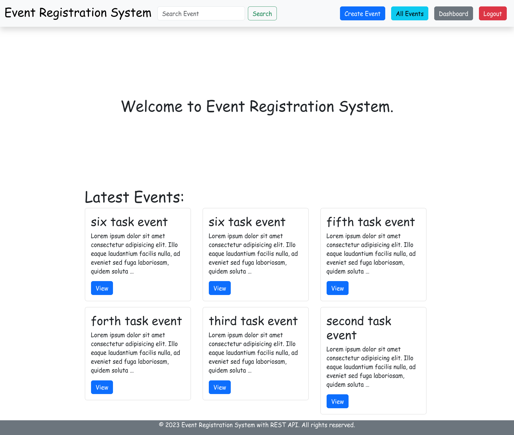
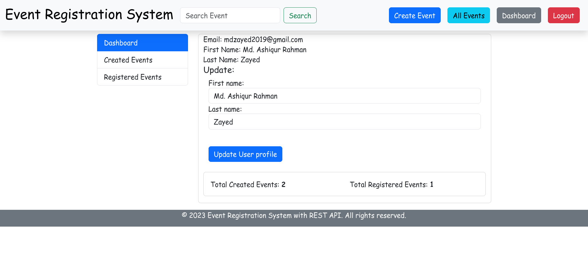
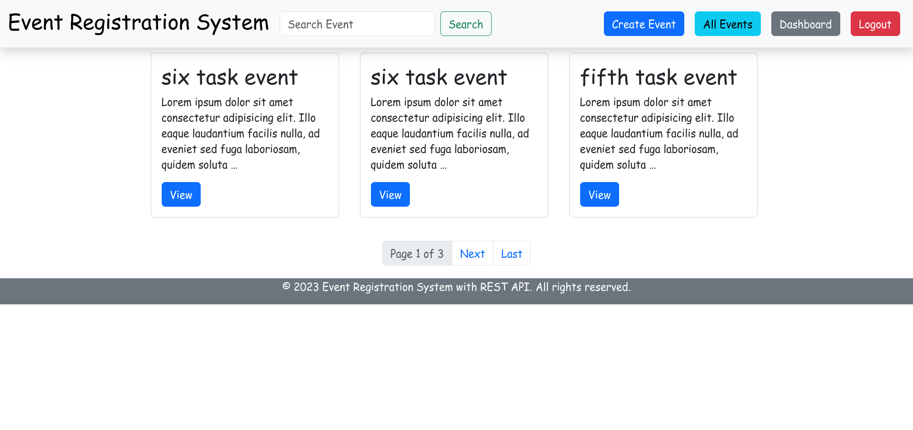
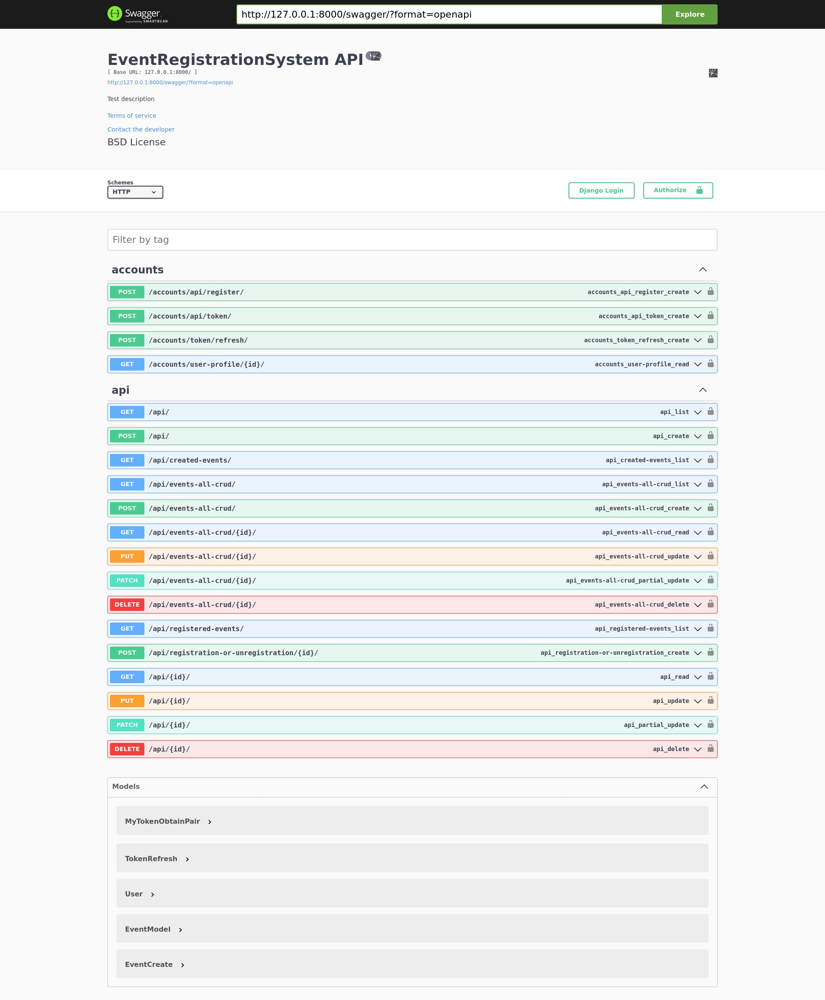

# EventRegistrationSystem
## Setup
The Event Registration System is a web-based platform designed to streamline the process of organizing and managing events.<br>
The first thing is cloneing the repository:
```sh
$ git clone https://github.com/MdAshiqurRahmanZayed/EventRegistrationSystem.git
$ cd EventRegistrationSystem  
```
Create a virtual environment to install dependencies in and activate it (This is for linux User):
```sh
$ python -m venv env
$ source env/bin/activate
```
Then install the dependencies:
```sh
(env)$ pip install -r requirements.txt
```
Create a Database in PostgreSQL.
Create info.py in the  EventRegistrationSystem folder just like info-demo.py and fill in the equivalent answer.You can create DJANGO_SECRET_PASSWORD from this website https://djecrety.ir/. <br>
We have to migrate.
```sh
(env)$ python manage.py makemigrations 
(env)$ python manage.py migrate 
(env)$ python manage.py createsuperuser
```
```sh
(env)$ python manage.py runserver
```
And navigate to `http://127.0.0.1:8000/`<br>

for API documentation ,get JSON data
```
$ 127.0.0.1:8000/swagger.json/
```
you can use swagger
```
http://127.0.0.1:8000/swagger/
```

## Demo image:<br>



